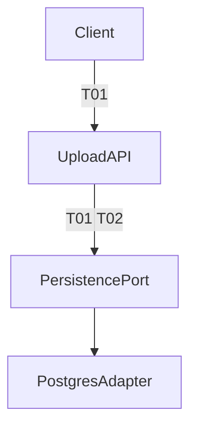
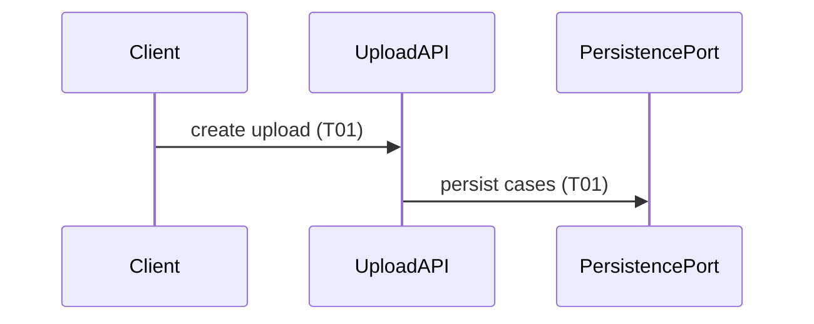

# Plan-mode Unified HLD

Disclosed reference for `/implement` in Plan mode. The CreatePlan body **must** open with this shape before any build todos.

## Required plan sections (in order)

### 1. Unified HLD

2–4 sentences: the end-to-end behaviour the tickets deliver **together**, from the user's perspective. Name which ticket(s) this `/implement` run will build.

### 2. Architecture

One Mermaid `flowchart` or `graph` of the modules at seams.

- Use `/codebase-design` vocabulary: **module**, **interface**, **seam**, **adapter** (not "service" / "component" / "boundary").
- Prefer domain glossary names from `CONTEXT.md` on nodes.
- Annotate nodes or edges with ticket ids (`T01`, `T02`, … matching the slice's ticket numbers) so ownership is visible.
- Show how the whole feature slice fits; highlight the ticket(s) in this run in labels (e.g. `T01 (this run)`).

### 3. Sequence

One Mermaid `sequenceDiagram` for the runtime happy path across the vertical slice(s).

- Participants are modules / actors at the seams (same names as the architecture diagram where possible).
- Label interactions with ticket ids where a ticket owns that step.
- One unified sequence for the feature behaviour — not a separate diagram per ticket unless the paths are genuinely disjoint.

### 4. Ticket map

Short list, one line per ticket in the slice:

- **Id + title** — what it owns in the diagrams — **Blocked by**

### 5. Build plan

Todos **only** for the ticket(s) this run will implement (frontier or user-named). Still gated on HLD approval — do not start coding in Plan mode.

## Mermaid hygiene

- No spaces in node IDs; use camelCase, PascalCase, or underscores.
- Quote labels that contain parentheses, commas, or colons.
- Do not use `style` / `classDef` colors — theme handles appearance.
- Prefer `flowchart TD` for architecture; `sequenceDiagram` for runtime flow.
- Keep diagrams readable: collapse internals that no ticket owns; show seams the tickets touch.

## Example skeleton

````markdown
# Implement: <feature or ticket title>

## Unified HLD

<2–4 sentences. This run builds T0N.>

## Architecture



## Sequence



## Ticket map

- **T01 — …** — owns … — Blocked by: None
- **T02 — …** — owns … — Blocked by: T01

## Build plan

- [ ] …
````
